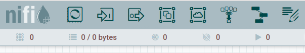
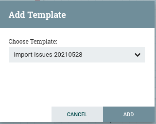
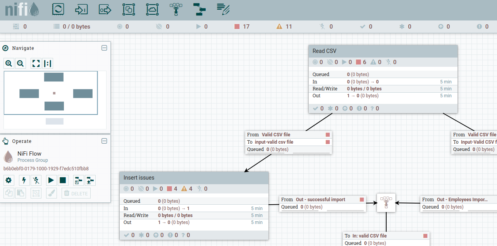
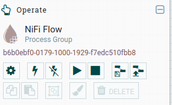
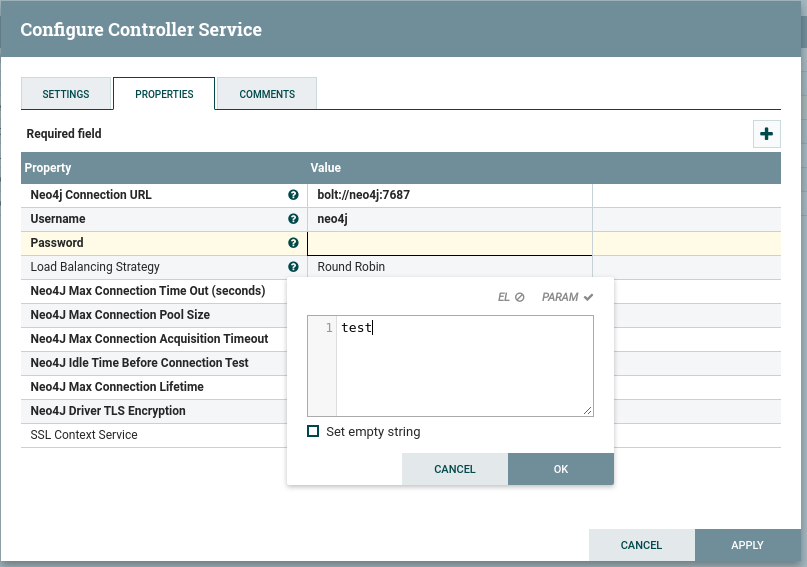
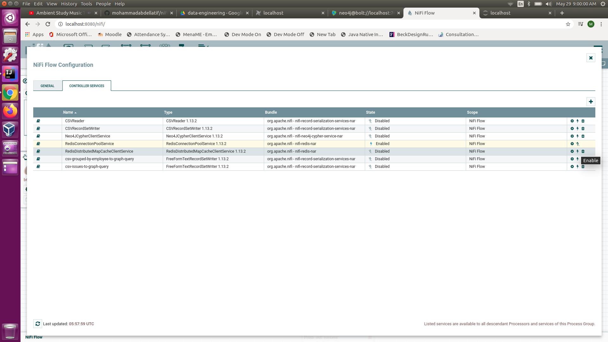
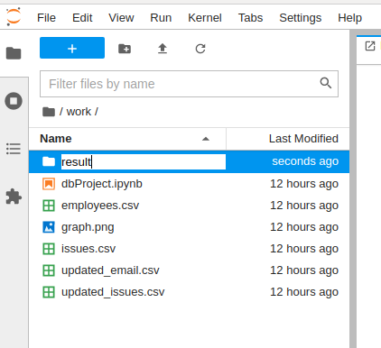
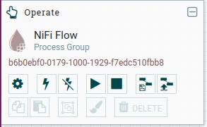

# Introduction
The purpose of this project is to demonstrate a data pipeline using Apache NiFi, the pipeline reads multiple
CSV files and loads them into a Neo4J (graph database) and creates a relation between the persisted nodes.

This is a deliverable for a Data Engineering course where we need to demonstrate how we need to prepare
datasets for analyses 

# Project Idea
The main idea is to collect datasets from GitLab and office 365 related to a software development team 
in a company and do the proper cleansing and aggregation to prepare it for analyses to help the upper
management in capturing developers behavior and provide some metrics which could help in yearly evaluation.

The sources of data are:
* [Issues](notebooks/updated_issues.csv) (tasks) dataset collect from GitLab providing details about development tasks:
    * Assignee ID
    * Reporter ID
    * Spent time
    * Estimated time
    * Open Date
    * Close Date
* [Emails Movement](notebooks/updated_email.csv) collected from office 365 for emails movement between company members:
    * Sender Address
    * Recipient Addresses
 
# Running the application
To run the demo, you need to have docker and docker-compose, to startup the demo:
```shell script
docker-compose up
```

To stop the demo click CTRL+C in the terminal or execute: 
```shell script
docker-compose down
```
All volumes should goes under current execution folder under ```./volumes``` folder, you might need to grant
proper permission to have all containers running correctly.

# Docker containers
Once the demo is started, you should have the below containers up and running:

| Container name | Purpose                                                                                                                                     | Access URL                                                                              |
|----------------|---------------------------------------------------------------------------------------------------------------------------------------------|-----------------------------------------------------------------------------------------|
| jupyter        | A jupyter notebook to demonstrate the python scripts used to analyze the datasets and to upload the CSV files to be imported by Apache NiFi | [http://localhost:8888](http://localhost:8888) the access token is psut2021             |
| neo4j          | A container running Neo4J database (graph) engine                                                                                           | [http://localhost:7474/browser/](http://localhost:7474/browser/) to browse the database |
| nifi           | A container running Apache NiFi through which the data pipeline will be run                                                                 | [http://localhost:8080](http://localhost:8080)                                          |
| redis          | A redis container used by Apache NiFi to persist temporary cache variables                                                                  |                                                                                         |
| elasticsearch  | A container running elastic search service to be used for indexing and seaching                                                             |                                                                                         |
| kibana         | A container running Kibana services to provide visualization capabilities on top of elastic search                                          | [http://localhost:5601](http://localhost:5601)                                          |

# Running the data pipeline
## Importing the data pipeline template:
* Through NiFi browser, drag the template icon from top bar to the design area  

  
* then select the template
  
    

    After adding the template, you should see the data pipeline as below, see the warnings in yellow which
    you need to fix before running the application
    
    
    
* You need to activate the controllers configured in the pipeline by clicking on configuration icon (Gear) 

  
* Navigate to controller services before enabling all services, you need to modify Neo4J connection pool by setting
    the password,  click on configure icon then update the password property by setting it to test
    
    
    After configurating this service, you need to enable all services
    
  
* Make sure there are no warnings in pipeline 
* You can start the data pipeline now by clicking on start button
* This pipeline waits for a CSV file to be generated under specific path, to generate this file, 
 navigate to jupyter notebook [http://localhost:8888](http://localhost:8888) 
 then you should see under work folder two CSV files: updated_issues.csv and update_emails.csv, you should
 copy them under result folder (create this folder if it is still not created):
 
  

* Navigate back to NiFi browser, you should see how bytes are read and transferred between the pipeline processors 

  
