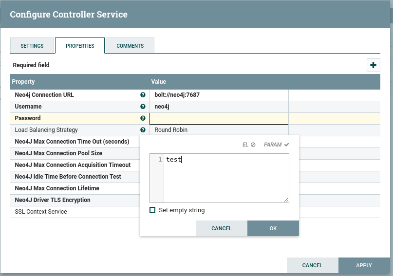
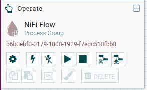
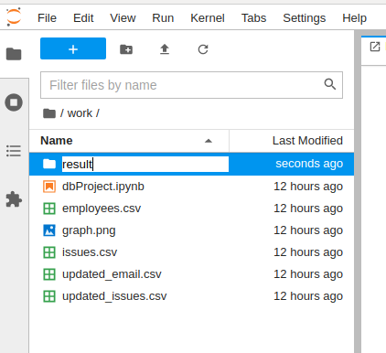

## Running the data pipeline
* A data pipeline template is defined in an XML file under [nifi](nifi/templates), from operate pallet
click on upload template button:

  

* Choose the xml template from [nifi][nifi/templates] then click upload

  

* From top menu, drag the template icon to the design area  

  
* then select the template
  
  

* After adding the template, you should see the data pipeline as below, see the warnings in 
yellow you need to fix before running the application
    
  
    
* You need to activate the controllers configured in the pipeline by clicking on configuration icon (Gear) 

  
  
* Navigate to controller services tab, you need to modify Neo4J connection pool by setting
    the password, click on configure icon then update the password property by setting it to test
    
  

* After configuring this service, you need to enable all other services, click on enable icon 
 for each service record 
    
  
  
* Make sure there are no warnings in pipeline 
* You can start the data pipeline now by clicking on start button

  
  
* This pipeline waits for a CSV file to be generated under specific path, to generate this file, 
 navigate to jupyter notebook [http://localhost:8888](http://localhost:8888) 
 then you should see under work folder two CSV files: updated_issues.csv and update_emails.csv, you should
 copy them under result folder (create this folder if it is still not created):
 
     

* Navigate back to NiFi browser, you should see how bytes read and
  transferred between the pipeline processors 

  